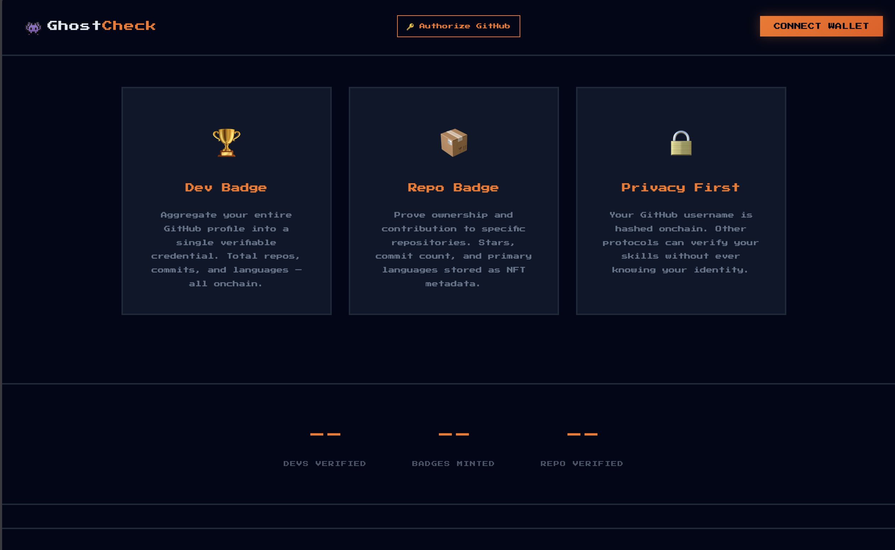
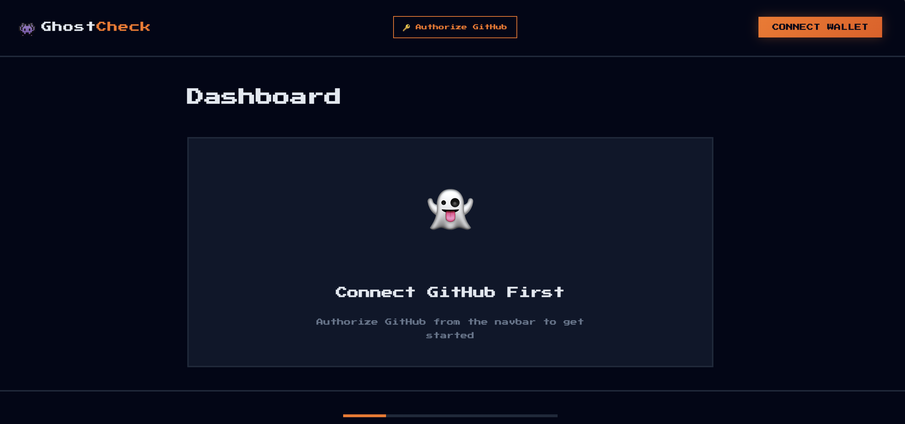
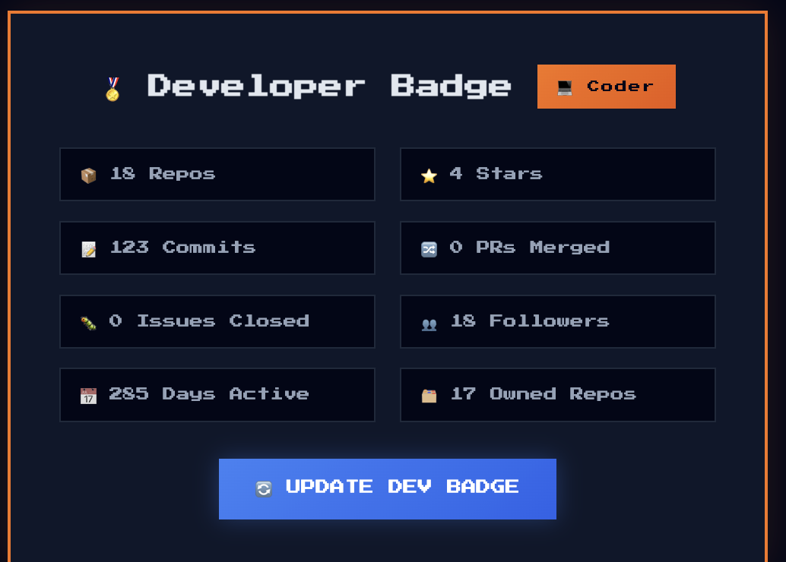

# GhostCheck UI Snippets & Proofs 📸

Here is a look at the current working MVP for GhostCheck.

## Landing Page

The entry point for the decentralized reputation application.

## Second Landing Section

## Dashboard (Minting & Verification)

The dashboard where developers connect their GitHub, fetch verified metrics from our oracle, and mint their soulbound Dev Badges.

## The Profile & Dev Badge

The fully rendered developer profile featuring the minted "Dev Badge" asset, showing on-chain verified stats.

